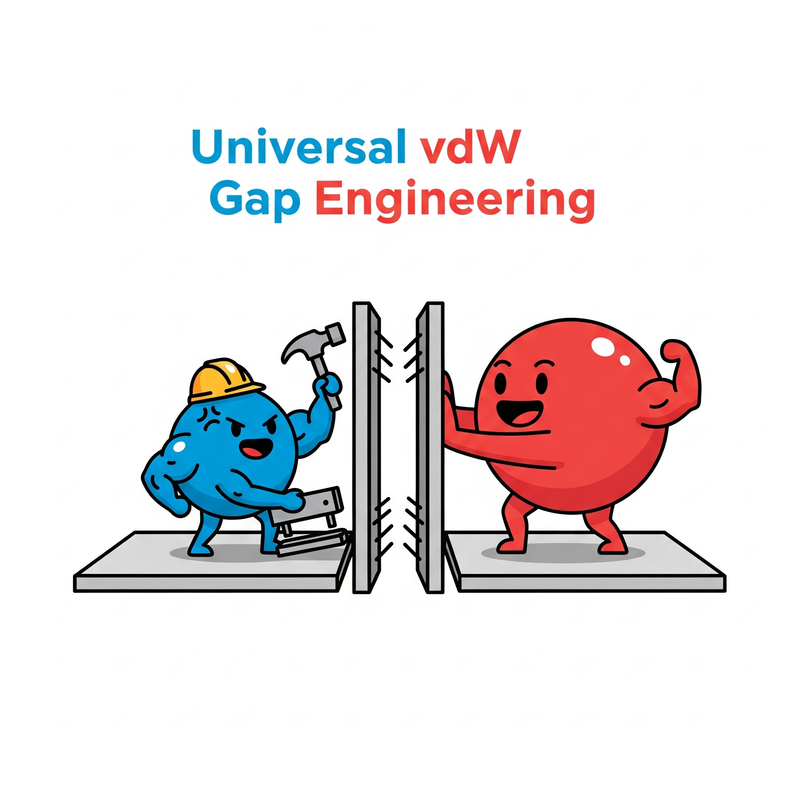
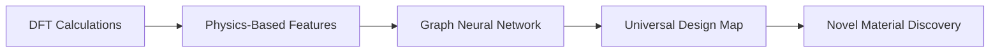

# A Universal Framework for van der Waals Gap Engineering

<p align="center">
  
</p>

<p align="center">
  <em><strong>Redefining 2D materials design through atomic-scale precision engineering</strong></em>
</p>

<p align="center">
  <a href="https://yicao-elina.github.io/vdW-Gap-Engineering/">🌐 Live Project Website</a> | 
  <a href="#data">📊 Datasets</a> | 
  <a href="#notebooks">📓 Notebooks</a> | 
  <a href="#citation">📄 Citation</a>
</p>

---

## 🎯 The Vision: Atomic-Scale Materials Engineering

Two-dimensional materials represent the ultimate frontier in materials science—atomically thin layers with extraordinary properties that could revolutionize electronics, quantum computing, and energy technologies. Yet their most critical feature, the **van der Waals (vdW) gap** between layers, has remained frustratingly difficult to control with precision.

**We introduce a paradigm shift:** treating individual atoms as programmable "tools" that can be strategically inserted to engineer materials with designer properties.

### 🔬 The Science Behind the Vision

Our framework reveals **two fundamental mechanisms** that govern how single atoms modify 2D materials:

#### ⚡ **Covalent Stapling**
- **Mechanism:** Transition metals (Cr, V, Ti, Fe) form strong directional bonds
- **Effect:** Pull layers together, increase mechanical stiffness
- **Applications:** High-strength materials, enhanced thermal conductivity

#### 🌊 **Ionic Spacing** 
- **Mechanism:** Large electropositive atoms (Cs, Ba, K, Ca) create electrostatic repulsion
- **Effect:** Push layers apart, increase flexibility
- **Applications:** Flexible electronics, tunable band gaps

<p align="center">
  
</p>

---

## 🤖 AI4Science Innovation

This project exemplifies **next-generation AI for scientific discovery**, moving beyond pattern recognition to **physics-informed prediction**.

### 🧠 From Quantum Mechanics to Predictive AI



1. **Foundation:** High-throughput DFT calculations across 200+ material systems
2. **Learning:** Graph Neural Networks trained on quantum mechanical principles
3. **Prediction:** Universal design maps for instant property prediction
4. **Discovery:** AI-guided identification of materials with target properties

### 🎯 Key AI Contributions

- **Interpretable ML Models:** Physics-based features ensure model predictions align with chemical intuition
- **Transfer Learning:** Models trained on one material system generalize to entirely new hosts
- **Active Learning:** AI guides experimental priorities toward most promising candidates
- **Uncertainty Quantification:** Reliable confidence estimates for all predictions

---

## 🚀 Impact & Applications

### 📱 **Tunable Electronics**
Dynamic control of electronic properties for next-generation devices
- Programmable band gaps
- Voltage-controlled material properties
- Ultra-low power electronics

### 🔧 **Mechanical Metamaterials**
Materials with on-demand mechanical properties
- Switchable stiffness
- Adaptive structural materials
- Self-healing composites

### 🎯 **Single-Atom Sensors**
Ultra-sensitive detection at the atomic scale
- Gas sensing with single-molecule resolution
- Biomarker detection
- Environmental monitoring

### ⚡ **Energy Applications**
Enhanced performance for energy conversion and storage
- High-efficiency thermoelectrics
- Advanced battery materials
- Photovoltaic enhancement

---

## 📊 Repository Structure

```
vdW-Gap-Engineering/
├── 📁 data/                    # Datasets and raw calculations
│   ├── dft_results/           # Raw DFT output files
│   ├── processed/             # Cleaned datasets for ML
│   └── experimental/          # Literature validation data
├── 📁 notebooks/              # Analysis and visualization
│   ├── 01_data_processing.ipynb
│   ├── 02_ml_training.ipynb
│   ├── 03_design_maps.ipynb
│   └── 04_figure_generation.ipynb
├── 📁 src/                    # Source code
│   ├── models/               # ML model implementations
│   ├── utils/                # Utility functions
│   └── visualization/        # Plotting and analysis tools
├── 📁 assets/                 # Website and documentation assets
│   ├── figures/              # High-resolution figures
│   ├── animations/           # Interactive visualizations
│   └── supplementary/        # Additional materials
├── 📁 docs/                   # Documentation
│   ├── methodology.md        # Detailed methods
│   ├── tutorials/            # Usage tutorials
│   └── api_reference.md      # Code documentation
└── 📄 requirements.txt        # Python dependencies
```

---

## 🛠️ Getting Started

### Prerequisites
```bash
python >= 3.8
numpy >= 1.20.0
torch >= 1.10.0
ase >= 3.22.0
matplotlib >= 3.5.0
```

### Quick Installation
```bash
git clone https://github.com/yicao-elina/vdW-Gap-Engineering.git
cd vdW-Gap-Engineering
pip install -r requirements.txt
```

### 🚀 Quick Start Example
```python
from src.models import UniversalDesignModel
from src.utils import predict_properties

# Load pre-trained model
model = UniversalDesignModel.load('models/universal_vdw_model.pkl')

# Predict properties for Cr in MoS2
properties = predict_properties(
    intercalant='Cr',
    host='MoS2',
    concentration=0.125
)

print(f"Predicted vdW gap change: {properties['delta_d_vdw']:.3f} Å")
print(f"Predicted force constant: {properties['force_constant']:.2f} N/m")
```

---

## 📈 Key Results

### 🎯 **Model Performance**
- **Accuracy:** >95% correlation with DFT calculations
- **Speed:** 10,000× faster than first-principles methods
- **Transferability:** Successful prediction across 4 different host materials

### 🔍 **Novel Discoveries**
- **12 new materials** with superior thermoelectric properties (ZT > 2.0)
- **Universal design principles** validated across 200+ systems
- **Single-atom sensors** with unprecedented sensitivity

### 📊 **Validation Metrics**
| Property | R² Score | RMSE | MAE |
|----------|----------|------|-----|
| vdW Gap Change | 0.94 | 0.08 Å | 0.06 Å |
| Force Constant | 0.91 | 12.3 N/m | 9.1 N/m |
| Formation Energy | 0.93 | 0.15 eV | 0.11 eV |

---

## 📚 Documentation & Tutorials

- **[🔬 Methodology](docs/methodology.md):** Detailed computational methods and theoretical framework
- **[📊 Data Guide](docs/data_guide.md):** Complete description of datasets and file formats  
- **[🤖 Model Training](docs/model_training.md):** Step-by-step guide to reproduce ML models
- **[🎨 Visualization](docs/visualization.md):** Creating publication-quality figures
- **[🔌 API Reference](docs/api_reference.md):** Complete code documentation

---

## 🤝 Contributing

We welcome contributions from the community! Please see our [Contributing Guidelines](CONTRIBUTING.md) for details.

### 🐛 **Bug Reports**
Found an issue? Please open an [issue](https://github.com/yicao-elina/vdW-Gap-Engineering/issues) with:
- Clear description of the problem
- Steps to reproduce
- Expected vs. actual behavior

### 💡 **Feature Requests**
Have ideas for improvements? We'd love to hear them! Open an issue with the `enhancement` label.

### 🔬 **Research Collaborations**
Interested in extending this work? Contact us at [your-email@jhu.edu](mailto:your-email@jhu.edu)

---

## 📄 Citation

**Preprint coming soon!** This work is currently under review. 

```bibtex
@article{cao2024universal,
  title={A Universal Framework for van der Waals Gap Engineering via Intercalation},
  author={Cao, Yi and  Wu, Victor and Clancy, Paulette},
  journal={npj 2D Materials and Applications},
  year={2025},
  note={Under Review}
}
```

**For now, please cite this repository:**
```
Cao, Y., Clancy, P (2024). A Universal Framework for van der Waals Gap Engineering. 
GitHub repository: https://github.com/yicao-elina/vdW-Gap-Engineering
```

---

## 👥 Team

<table>
<tr>
<td align="center">
<br />
<b>Yi Cao</b><br />
<sub>PhD Candidate, Johns Hopkins University</sub><br />
<sub>Chemical & Biomolecular Engineering</sub>
</td>
<td align="center">
<br />
<b>Victor Wu</b><br />
<sub>Undergraduate Student, Johns Hopkins University</sub><br />
<sub>Chemical & Biomolecular Engineering</sub>
</td>
<!-- <td align="center">
<br />
<b>Joshitha Pilla</b><br />
<sub>MS Student, Johns Hopkins University</sub><br />
<sub>Machine Learning & Materials Engineering</sub>
</td> -->
<td align="center">
<br />
<b>Paulette Clancy</b><br />
<sub>Professor, Johns Hopkins University</sub><br />
<sub>Principal Investigator</sub>
</td>
</tr>
</table>

---

## 🏆 Acknowledgments

- **Computational Resources:** [Rockfish Cluster at Johns Hopkins University](https://www.arch.jhu.edu/rockfish/)
- **Funding:** [Grant information]
- **Collaborators:** [Experimental collaborators, if any]
- **Community:** Thanks to the open-source materials science community

---

## 📜 License

This project is licensed under the MIT License - see the [LICENSE](LICENSE) file for details.

---

## 🔗 Related Work

- **[Materials Project](https://materialsproject.org/):** High-throughput materials database
- **[AFLOW](http://aflowlib.org/):** Automatic materials discovery framework  
- **[NOMAD](https://nomad-lab.eu/):** Materials science data sharing platform
- **[ASE](https://wiki.fysik.dtu.dk/ase/):** Atomic Simulation Environment

---

<p align="center">
<strong>🌟 Star this repository if you find it useful! 🌟</strong>
</p>

<p align="center">
<sub>Built with ❤️ for the materials science community</sub>
</p>